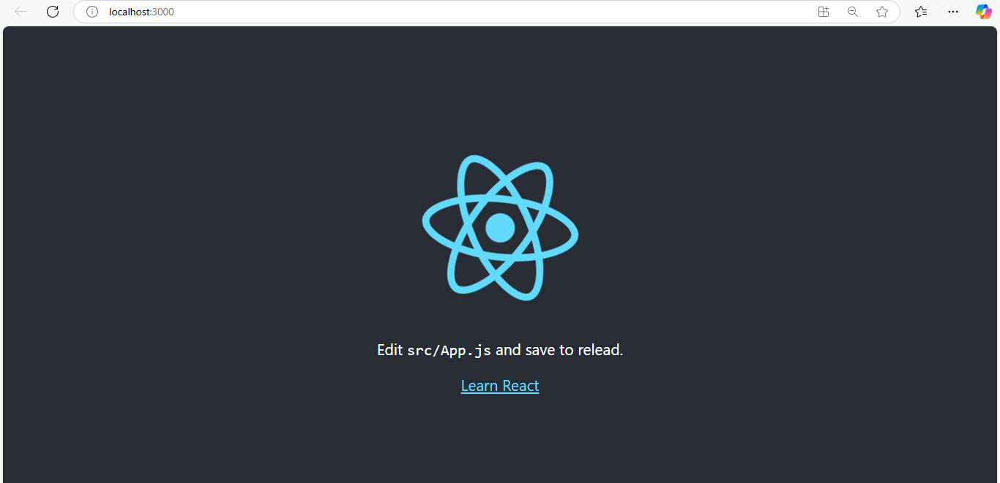
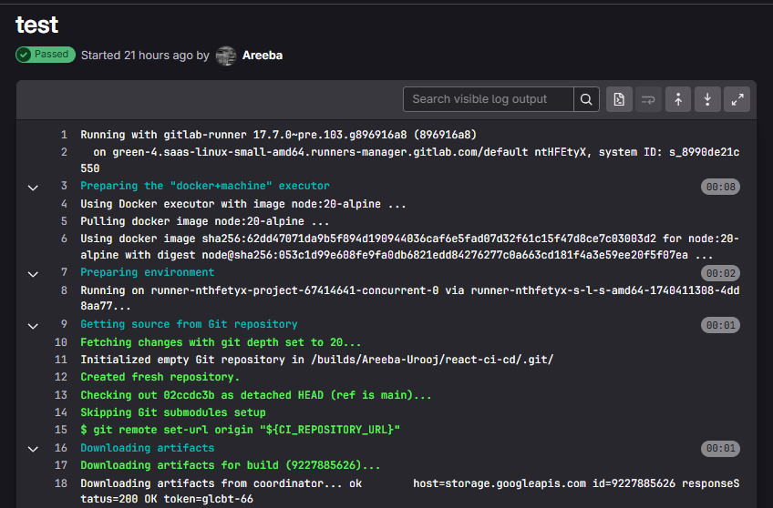
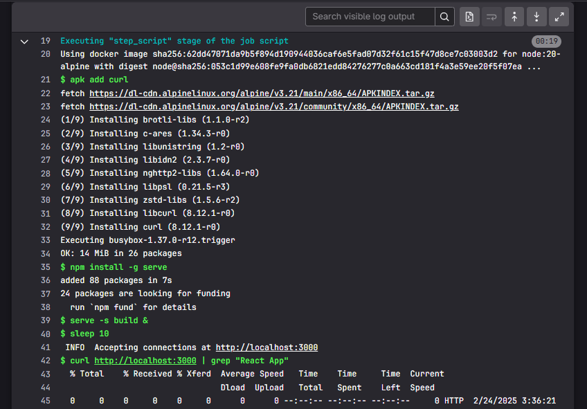
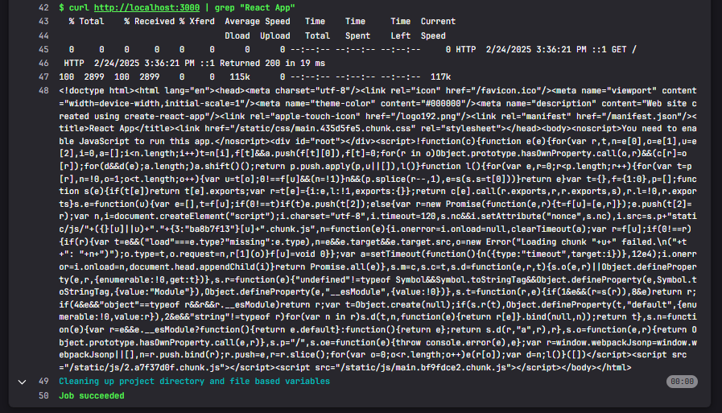
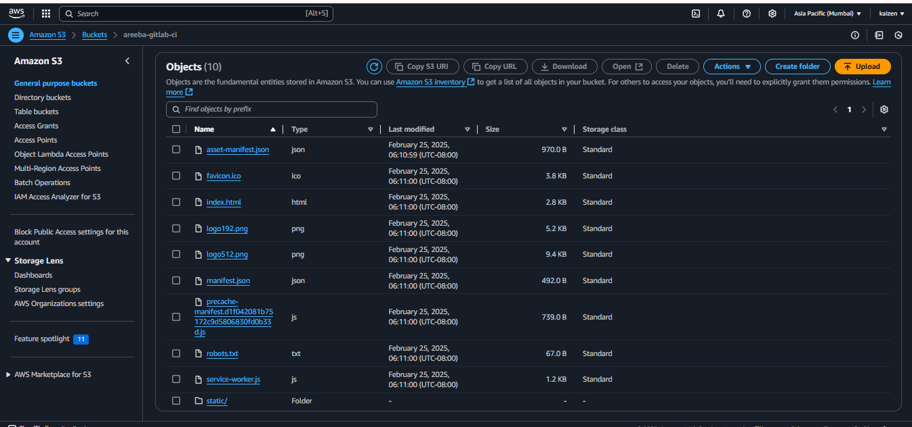
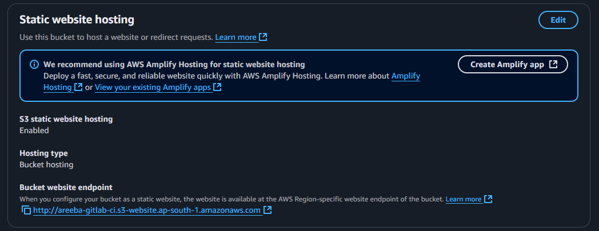
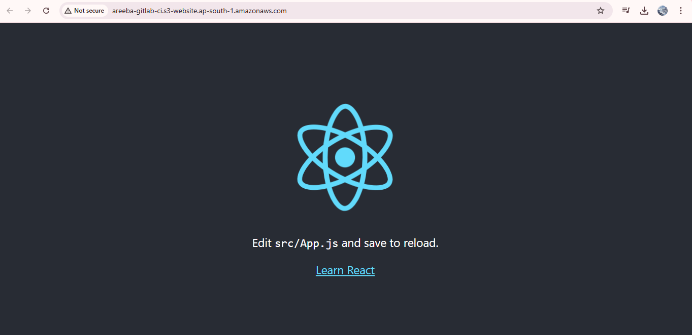
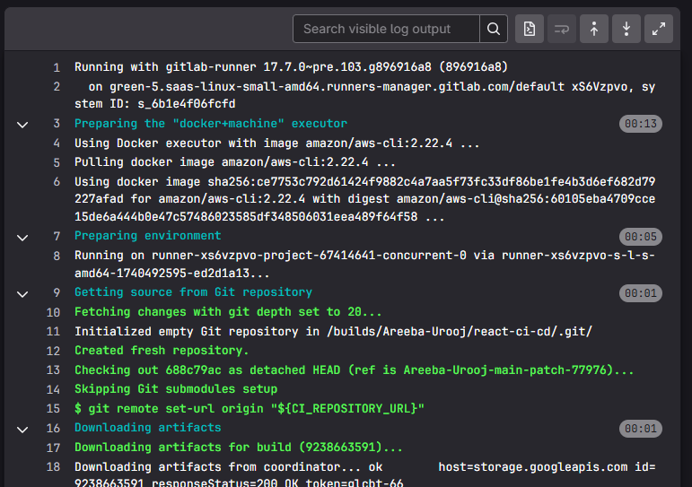
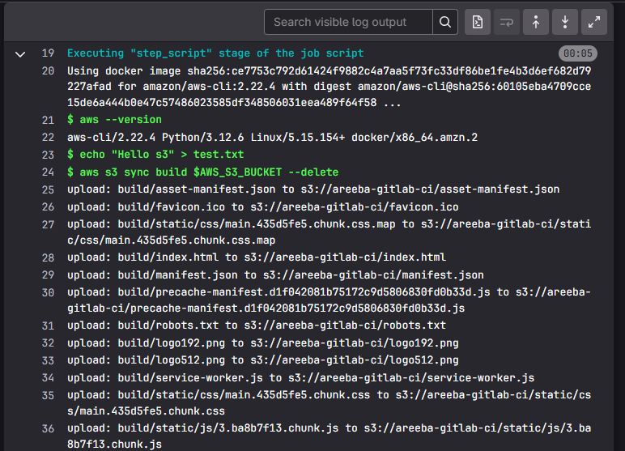
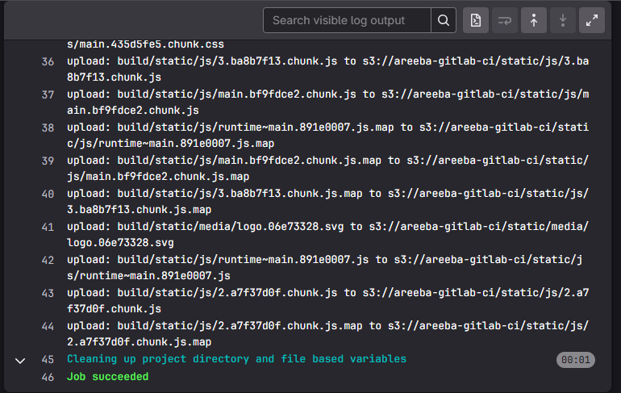

# GitLab CI/CD Project

## Overview

This comprehensive guide details the implementation of a robust CI/CD pipeline for a React application using GitLab CI/CD. The pipeline streamlines the development workflow by automating the build, test, and deployment processes to both staging and production environments hosted on AWS S3.

Our CI/CD pipeline ensures code quality and reliability through automated testing while providing a seamless deployment experience. This approach significantly reduces manual intervention, minimizes deployment errors, and accelerates the delivery of new features to users.

*Visual representation of our React application pipeline flow*

## Pipeline Architecture

The pipeline consists of six sequential stages designed to validate and deploy code with increasing levels of confidence:

1. **Build** - Compiles and packages the React application
2. **Test** - Validates application functionality through automated tests
3. **Deploy Staging** - Pushes code to the staging environment for pre-production verification
4. **Test Staging** - Confirms the staging deployment functions correctly
5. **Deploy Production** - Delivers validated code to the production environment
6. **Test Production** - Verifies the production deployment meets all requirements

## Environment URLs

Access the deployed applications at:

* **Production Environment**: [http://areeba-gitlab-ci.s3-website.ap-south-1.amazonaws.com](http://areeba-gitlab-ci.s3-website.ap-south-1.amazonaws.com)
* **Staging Environment**: [http://areeba-gitlab-ci-staging.s3-website.ap-south-1.amazonaws.com](http://areeba-gitlab-ci-staging.s3-website.ap-south-1.amazonaws.com)

## Detailed Stage Breakdown

### Build Stage

The build stage creates a deployable version of the application using a Node.js 20 Alpine container image.

**Key operations:**
* Installs all project dependencies via `npm install`
* Builds the application with legacy OpenSSL provider enabled to ensure compatibility
* Preserves build artifacts for subsequent pipeline stages using GitLab's artifact management

### Test Stage

The test stage runs two parallel jobs to ensure application quality:

**Functional Testing:**
* Serves the built application locally using the lightweight `serve` package
* Verifies application availability by checking for the presence of "React App" in the response
* Confirms the application renders correctly in a production-like environment

**Unit Testing:**
* Executes the application's automated test suite via `npm test`
* Validates individual components and functions work as expected
* Catches regressions before code reaches production

### Deploy Stage

The deploy stage prepares application artifacts for deployment to both environments:

**Key operations:**
* Creates a dedicated public directory structure for web hosting
* Copies all build files into the public directory
* Only executes when changes are pushed to the main branch
* Ensures all assets are properly organized for S3 deployment

*Screenshots showing the deploy stage execution logs*

## AWS Configuration & Preparation

### IAM User Configuration

Before implementing the deployment pipeline, we created a dedicated IAM user with the appropriate permissions for S3 operations. This approach follows the principle of least privilege, ensuring the pipeline has only the permissions necessary to deploy the application without compromising security.

**Benefits of dedicated IAM user:**
* Limits access to only required AWS resources
* Provides an isolated security context for CI/CD operations
* Enables credential rotation without affecting other systems
* Simplifies auditing and tracking of deployment activities

### Deploy to Staging Environment

The staging deployment process pushes the application to a pre-production environment that mirrors production:

**Key operations:**
* Utilizes AWS CLI to synchronize the build directory with the staging S3 bucket
* Only triggers on the default (main) branch to prevent unauthorized deployments
* References the `$AWS_S3_BUCKET_STAGING` environment variable to identify the correct destination
* Ensures all static assets maintain proper permissions and content types

### Test Staging Environment

After deploying to staging, automated verification ensures the deployment was successful:

**Key features:**
* Performs HTTP requests to the staging URL to verify availability
* Validates application content by checking for the presence of "React App" in the response
* Provides immediate feedback on deployment success or failure
* Acts as a gate before proceeding to production deployment

### Deploy to Production Environment

Once testing confirms the staging deployment is successful, the pipeline proceeds to production:

**Key operations:**
* Employs AWS CLI to synchronize build files with the production S3 bucket
* Executes only on the default branch to maintain deployment control
* Utilizes the `$AWS_S3_BUCKET` environment variable to target the production environment
* Maintains identical file structure and permissions as staging

### Test Production Environment

The final stage verifies the production deployment meets all requirements:

**Key features:**
* Runs the same verification process as staging but against the production URL
* Confirms the application is accessible to end users
* Validates critical application content
* Provides final confirmation of successful deployment completion

*Accessing the application through the S3 static website hosting URL*

*Screenshots of the successfully deployed application*

*Logs confirming successful S3 deployment*

## Configuration Requirements

The pipeline relies on several environment variables that must be configured in GitLab:

| Variable | Description | Purpose |
|----------|-------------|---------|
| `AWS_S3_BUCKET` | Production bucket URL | Deployment destination for production |
| `AWS_S3_BUCKET_STAGING` | Staging bucket URL | Deployment destination for staging |
| `AWS_ACCESS_KEY_ID` | AWS access credential | Authentication for S3 operations |
| `AWS_SECRET_ACCESS_KEY` | AWS secret credential | Authentication for S3 operations |
| `AWS_DEFAULT_REGION` | AWS region identifier | Specifies the deployment region |

**Note:** For security reasons, all AWS credentials should be configured as masked variables in GitLab CI/CD settings.

## Implementation Guide

To implement this pipeline for your own React application, follow these steps:

1. **Set up AWS resources:**
   * Create two S3 buckets (production and staging)
   * Configure both buckets for static website hosting
   * Set appropriate bucket policies for public access

2. **Configure GitLab variables:**
   * Navigate to Settings > CI/CD > Variables
   * Add all required AWS credentials and bucket information
   * Mark sensitive credentials as "masked" and "protected"

3. **Commit pipeline configuration:**
   * Add the `.gitlab-ci.yml` file to your repository root
   * Ensure your React application includes the text "React App" in its HTML (or modify the verification step)
   * Push changes to trigger the initial pipeline run

4. **Verify deployment:**
   * Monitor the pipeline execution in GitLab
   * Check each stage for successful completion
   * Visit both staging and production URLs to confirm deployment

## Troubleshooting

If you encounter issues with the pipeline, check these common problem areas:

* **Build failures:** Verify Node.js compatibility and dependency availability
* **Test failures:** Ensure tests are properly configured and application content matches verification criteria
* **Deployment failures:** Check AWS credentials, bucket permissions, and S3 configuration
* **URL accessibility:** Confirm bucket policy allows public access and website hosting is enabled

**Common error:** If you receive errors during the deploy stage, first verify your AWS credentials and ensure the IAM user has appropriate S3 permissions.

## Best Practices

To maintain an effective CI/CD pipeline:

* Regularly rotate AWS credentials for security
* Add additional test coverage as the application evolves
* Consider implementing a manual approval step before production deployment
* Monitor S3 access logs for unexpected traffic patterns
* Back up bucket configurations to prevent accidental changes

---

This CI/CD implementation demonstrates a streamlined approach to React application deployment using GitLab and AWS S3. The multi-stage pipeline ensures code quality while providing reliable, automated deployments to both staging and production environments.
